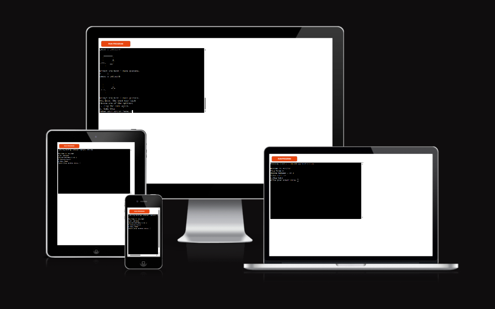
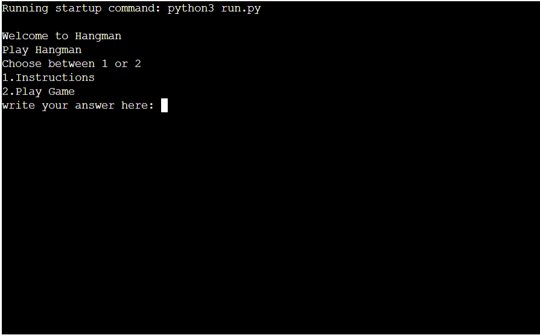
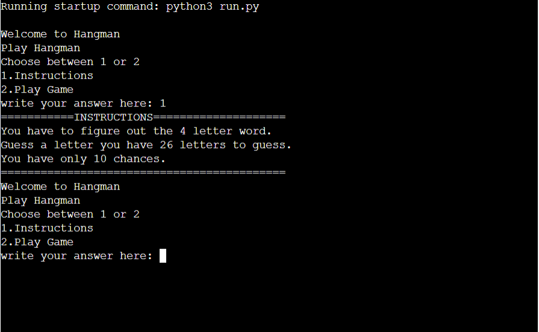
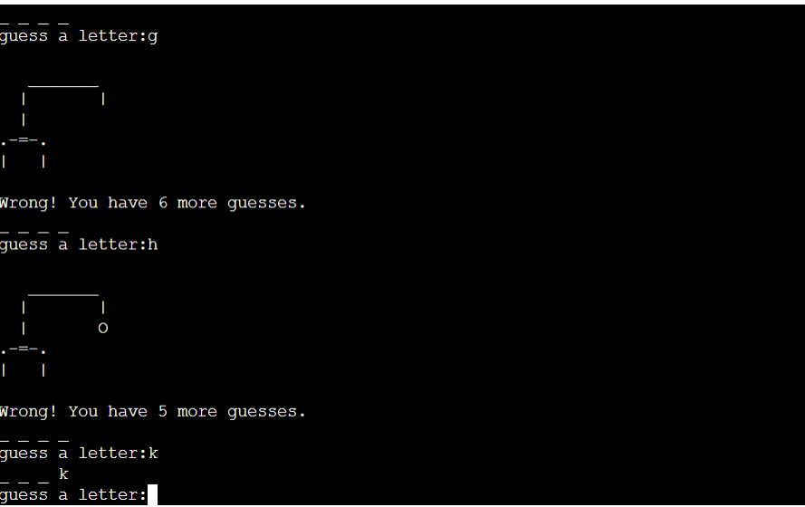
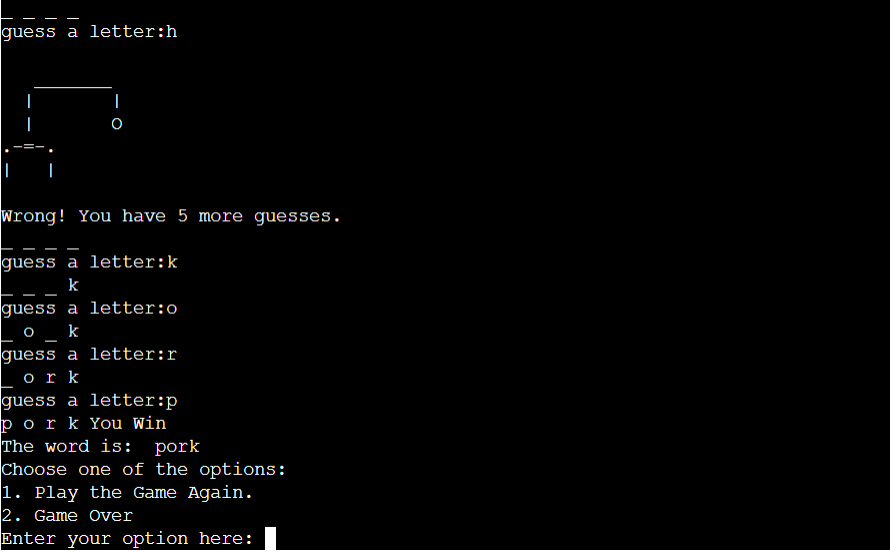
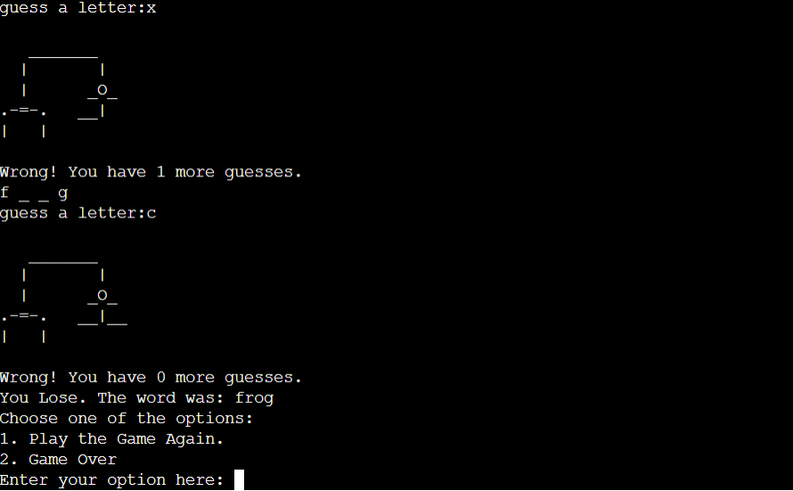
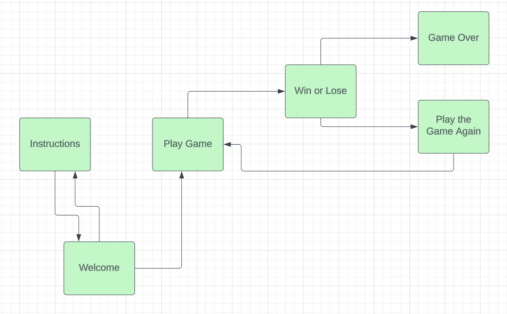
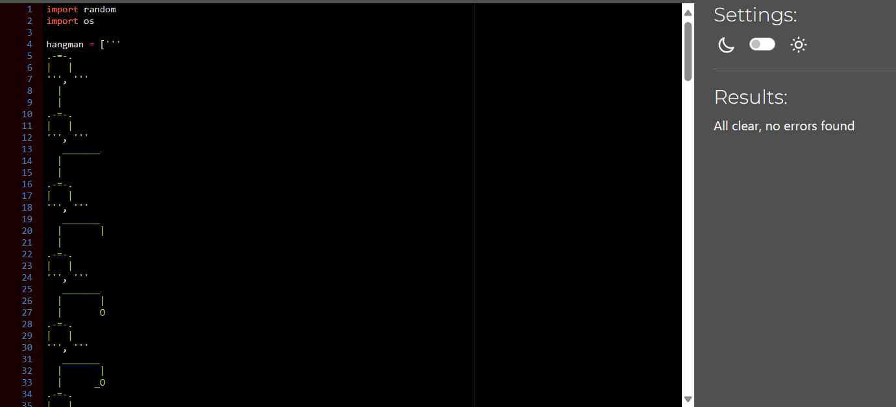

# Hangman Game
[my live project](https://hangman2219-5c92e2b0875a.herokuapp.com/)

## User Experience (UX):

This section is added to show how the game is made. Also show that it is as user-friendly as possible.

The project's goal is to show how to easily play a satisfying game that is a little challenging.

### User Stories:

- As a user, it should be easy to know what the game is called.
- As a user, it should be easy to know the rules of the game by choosing instructions as the first option.
- As a user, it should be easy to start playing by choosing option 2.
- As a user, it should be easy to play by choosing a letter.
- As a user, it should be challenging to guess which word by continuing to guess letters.
- As a user, it should be easy to have ten incorrect chances to guess the word.
- As a user, it should be easy to play again and if the user does not want to, the user can quit.

## Features:
- This is a classic game that you usually play at school. In this game you have a chance to figure out the word that is 4 letters long. It's fun for young and old alike if you like puns. Easy to play and accessible to everyone.
### Existing Features:
- Here the user have the start. 

- Here are the instructions.

- When the user actually playing the game.

- And here is when the user win the game.

- And when the user lose.

## Future Development:

- In the future I will probably add longer words and more colors. Even a little more style on the hanging man.

### Design:

- This equipment is a reminder of when the nokia 3210 or 3310 came about 25 years ago when you sent different messages with brackets and different variants. It should seem like you are rediscovering the late 90s early 00s. The design is simple, not too difficult, but still quite stylish.

- Flow Charts.

## Testing:

-Result automatic testing

## Manual Testing:

### User Story Testing:

- As a user, it should be easy to know what the game is called.
    - When the user comes to the page, you easily see that the game is called Hangman and have the options in front of them.
- As a user, it should be easy to know the rules of the game by choosing instructions as the first option.
    - When you get to the slide, the options are clear and you can easily choose.
- As a user, it should be easy to start playing by choosing option 2.
    - When the options appear, the user sees that it is easy to play by choosing option 2
- As a user, it should be easy to play by choosing a letter.
    - When the user tries a letter, a response is received that the user has chosen the right, wrong or too many letters. If the user selects an invalid character, the user is prompted to select a letter again.
- As a user, it should be challenging to guess which word by continuing to guess letters.
    - When the user plays and tests different letters, the user sees if it is right or wrong and if it is right, the user can guess the right word by typing in the remaining letters. Which can be fun and challenging.
- As a user, it should be easy to have ten incorrect chances to guess the word.
    - When the user plays, it gets a clear message how many incorrect guesses the user has left.
- As a user, it should be easy to play again and if the user does not want to, the user can quit.
    - When the user has finished playing, the user gets a clear message to play again and if the user does not want to, the user can stop by choosing option 2.

## Known Bugs:

- No known issuse at the moment.

## Deployment:

How this site was deployed to Heroku

Steps followed to deploy:
- First, the user logs into Heroku.
- When you are on the Heroku website, click on the "create new app" button.
- Then you write the name hangman2219 and select region. Then click on "create app".
- Then click on 'config vars' and write 'port' in the key box and '8000' in the value box.
- Then you add python and nodejs to 'Buildpacks'. Then you save the changes.
- Linking the repository to the app.
- Clicking on deploy branch.
[my live project](https://hangman2219-5c92e2b0875a.herokuapp.com/)

## Technologies Used:

- Python
- Heroku for deploying the app.

## Credits:

- [Python program for word guessing game](https://www.geeksforgeeks.org/python-program-for-word-guessing-game/) - this website was followed and some Python code was taken and adapted to my game.

- [Movie tickets Booking management system in Python](https://www.geeksforgeeks.org/movie-tickets-booking-management-system-in-python/) - this website was used to provide function "def welcome():".

## Acknowledgements: 
- Thanks to my mentor Spencer for all guidance and help.